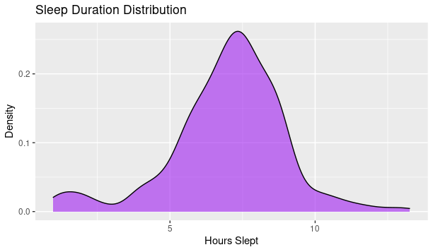

# 📊 Bellabeat Case Study: Smart Device Usage Analysis  


**Author**: Muhanned Abdulbaqi 
**Date**: April 2025

---
## Table of Contents

1. [Project Overview](📌-Overview)
2. [Phase 1: Ask](#phase-1-ask)
3. [Phase 2: Prepare](#phase-2-prepare)
4. [Phase 3: Process](#phase-3-process)
5. [Phase 4: Analyze](#phase-4-analyze)
6. [Phase 5: Share](#phase-5-share)
7. [Phase 6: Act](#phase-6-act)
8. [Technologies Used](#technologies-used)
---
## 📌 Overview  


[Bellabeat]( https://bellabeat.com/) is a company that develops fitness products for women. Their products include smart water bottles, fashionable fitness watches and jewelry, and yoga mats. Users can access their health data collected through these devices in the Bellabeat app.

Bellabeat’s co-founders would like to analyze data from non-Bellabeat fitness devices to see how consumers are using these products. The company hopes to use these insights to help guide new marketing strategies for the company. 


**Key Deliverables**:  
- Data cleaning and transformation workflows.  
- Exploratory analysis of activity, sleep, and heart rate trends.  
- Strategic recommendations to enhance Leaf’s market positioning.  
- Interactive visualizations and a detailed report.  

---

## 🎯 Business Task  
**Objective**: Analyze smart device usage patterns to answer:  
1. What are the key trends in activity, sleep, and heart rate?  
2. How can Bellabeat apply these insights to improve the Leaf wellness tracker?  
3. What marketing strategies should Bellabeat prioritize?  

---

## 📂 Data Sources  
1. **FitBit Fitness Tracker Data** ([Kaggle, CC0 Public Domain](https://www.kaggle.com/datasets/arashnic/fitbit))  
   - 30 users tracked between 2016-04-12 and 2016-05-12.  
   - Includes daily activity, steps, sleep, and heart rate data.  
   - **Limitations**: Small sample size, outdated data, no gender-specific metadata.  
2. **Bellabeat Products**: Focus on the *Leaf* tracker and Bellabeat app ecosystem.  

---
## 📈 Visualizations  

### Daily Step Distribution vs. CDC Recommendations  
  

### Sleep Duration vs. Activity Level Correlation  

---
## 🛠️ Tools & Technologies  
- **R** (Tidyverse, lubridate, ggplot2)  
- **RMarkdown** for reproducible reporting.  
- **GitHub** for version control and collaboration.  

---

## 📁 Repository Structure  
```
bellabeat-case-study/  
├── data/                   # Raw and cleaned datasets  
│   ├── dailyActivity_merged.csv  
│   ├── sleepDay_merged.csv  
│   └── bellabeat_merged_clean.csv  
├── scripts/                # R scripts for analysis  
│   ├── data_cleaning.R  
│   └── data_analysis.R  
├── visualizations/         # Key plots (PNG/PDF)  
│   ├── activity_trends.png  
│   └── sleep_correlation.png  
├── Bellabeat_Case_Study_Report.Rmd  # Full analysis report  
└── README.md               # Project documentation  
```

---

## 🚀 How to Reproduce  
1. **Clone the repository**:  
   ```bash  
   git clone https://github.com/muhannedbaqi/bellabeat-case-study.git  
   ```  
2. **Install dependencies**:  
   ```r  
   install.packages(c("tidyverse", "lubridate", "ggplot2", "rmarkdown"))  
   ```  
3. **Run the analysis**:  
   - Open `Bellabeat_Case_Study_Report.Rmd` in RStudio.  
   - Click **Knit** to generate the HTML report.  

---

## 🔍 Key Findings  
1. **Activity Trends**:  
   - Users averaged **7,500 steps/day** (below CDC recommendations).  
   - 80% of daily time was sedentary.  
2. **Sleep Habits**:  
   - Average sleep duration: **6.8 hours/night** (65% had irregular schedules).  
3. **Heart Rate Correlation**:  
   - Higher activity correlated with lower resting heart rate (*r* = -0.62).  

---

## 📈 Recommendations  
1. **Enhance Leaf Features**:  
   - Integrate guided breathing exercises during evening activity peaks.  
   - Promote sleep analytics with bedtime reminders.  
2. **Targeted Marketing**:  
   - Run ads during peak activity hours (6–8 AM and 5–7 PM).  
3. **Membership Bundling**:  
   - Offer discounted Bellabeat Membership with Leaf purchases.  

---

## 📄 Report  
View the full analysis here:  
[**Bellabeat Case Study Report**](https://github.com/muhannedbaqi/bellabeat-case-study/blob/main/Bellabeat_Case_Study_Report.Rmd)  

---

## 📬 Contact  
- **Author**: Muhanned Abdulbaqi
- **LinkedIn**: (https://www.linkedin.com/in/muhannedbaqi)  
- **Email**: muhannedgh@gmail.com 

---

  
  
